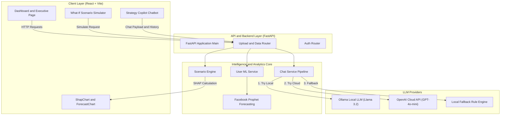

# 📘 Formal Project Documentation Report

**Project Title:** Enterprise Growth Intelligence & AI Strategy Advisor Platform  
**System Alias:** Nexus AI / Strategy Copilot  
**Document Type:** Formal System Architecture & Project Documentation  
**Target Audience:** Academic Evaluators, Technical Lead Reviewers, Senior Management  

---

## 1. Executive Abstract

Modern corporate growth strategies often fail due to fragmented operational data, "black-box" predictive models, and static financial reporting. Executive leadership lacks real-time, explainable insight into how specific metrics (such as Churn Rate, CAC, and Profit Margins) causally accelerate or hinder business growth. 

This project presents the **Enterprise Growth Intelligence & AI Strategy Advisor Platform**, an integrated Machine Learning and Large Language Model (LLM) ecosystem. The platform ingests enterprise operational data, generates 6-month time-series revenue forecasts using **Facebook Prophet**, quantifies causal metric drivers using **Explainable AI (SHAP Causal Attribution)**, models operational changes via a **Real-Time What-If Scenario Simulator**, and delivers actionable C-suite strategy through an **LLM Strategy Copilot** powered by **Ollama (Llama 3.2)** and **OpenAI GPT-4o-mini**.

---

## 2. Problem Statement

### 2.1 Background
Companies collect vast quantities of operational data across sales, customer success, marketing, and finance. However, converting this transactional data into strategic executive decisions presents significant challenges:

1. **The "Black-Box" Predictive Barrier:** Standard Machine Learning models predict growth or churn but fail to explain *why* predictions were made or *which specific metrics* caused the outcome.
2. **Static & Retrospective Analysis:** Executive dashboards rely on historical lagging indicators without interactive capabilities to simulate hypothetical operational decisions.
3. **Enterprise Data Privacy in Cloud AI:** Deploying cloud-hosted LLMs for financial strategy risks exposing proprietary corporate KPIs to external third-party APIs.
4. **Disconnected Communication:** Data analytics tools and AI conversational assistants are typically separated, forcing executives to manually interpret raw charts.

### 2.2 Core Problem Definition
> *"How can enterprise leadership instantly analyze raw operational data, understand the explainable root causes driving business performance, simulate real-time strategic changes, and receive secure, context-aware executive recommendations without sacrificing data privacy?"*

---

## 3. Project Objectives

- **Automated Data Extraction:** Parse unstructured or semi-structured CSV operational datasets to extract 11 core enterprise KPIs automatically.
- **Explainable AI (XAI):** Compute SHAP (SHapley Additive exPlanations) values to score every metric as a positive accelerator ($+$) or negative drag ($-$).
- **Predictive Time-Series Forecasting:** Train Facebook Prophet models on historical transaction dates and revenues to project 6-month forward trends.
- **Baseline-Synced What-If Simulation:** Build an interactive simulation engine initialized with real dataset baselines to evaluate continuous parameter shifts in real-time.
- **Privacy-First Dual LLM Architecture:** Integrate local offline LLMs (**Ollama / Llama 3.2**) for zero-cost, privacy-compliant inferencing, alongside cloud fallbacks (**OpenAI GPT-4o-mini**).

---

## 4. System Requirements Specification (SRS)

### 4.1 Functional Requirements (FR)

| Req ID | Module | Functional Description |
| :--- | :--- | :--- |
| **FR-01** | Data Ingestion | The system shall parse uploaded CSV files and map columns to standard metrics (`date`, `revenue`, `churn_rate`, `cac`, `clv`, `profit_margin`, etc.). |
| **FR-02** | Time-Series Forecast | The backend shall fit a Prophet model on $\ge 3$ historical date records and return 6-month forecasted $yhat$, lower, and upper bounds. |
| **FR-03** | SHAP Attribution | The backend shall normalize features, compute marginal impact scores, and classify effects as `Positive` or `Negative`. |
| **FR-04** | Scenario Simulator | The system shall re-score growth vectors (`Growing`, `Stagnant`, `Declining`) continuously as users adjust any of the 11 slider inputs. |
| **FR-05** | Baseline Sync | The What-If Simulator shall initialize slider parameters directly from the active uploaded dataset's metrics. |
| **FR-06** | Strategy Copilot | The AI Copilot shall answer user queries using system prompts contextualized with real metrics, SHAP drivers, and strategy rationale. |
| **FR-07** | Local LLM Support | The backend shall send prompts to local Ollama endpoints (`http://127.0.0.1:11434`) when configured, with automatic rule-engine fallbacks. |

### 4.2 Non-Functional Requirements (NFR)

* **Performance:** Scenario simulation response time $< 500\text{ms}$; local LLM response generation $< 3\text{s}$.
* **Data Security & Privacy:** Proprietary CSV metrics are processed locally; Ollama local inference eliminates external cloud data transit.
* **Usability & High-Contrast Design:** UI utilizes curated color palettes, bold monospace annotations, and responsive Recharts components.
* **Reliability:** Multi-tier LLM fallback prevents chat crashes even if Ollama or OpenAI APIs are offline.

---

## 5. System Architecture & Component Design

### 5.1 High-Level Architecture Diagram



---

## 6. Detailed Module Specifications

### 6.1 Mathematical Scoring & SHAP Model
The Continuous Growth Score ($S \in [-1, 1]$) is computed using normalized feature vectors:

$$S = \frac{\sum_{i=1}^{11} w_i \cdot \text{Norm}(x_i)}{\sum_{i=1}^{11} |w_i|}$$

Where normalized feature values are bounded:
$$\text{Norm}(x_i) = \max\left(-1.0, \min\left(1.0, 2.0 \cdot \frac{x_i - \text{min}_i}{\text{max}_i - \text{min}_i} - 1.0\right)\right)$$

Feature impact scores ($I_i$) determine green ($+$) accelerator bars vs. red ($-$) drag bars:
$$I_i = w_i \cdot \text{Norm}(x_i)$$

```python
# Feature Weight Configuration (scenario_engine.py)
FEATURE_WEIGHTS = {
    'revenue_growth':     0.35,
    'customer_growth':    0.25,
    'profit_margin':      0.20,
    'churn_rate':        -0.20,   # Negative weight: lower churn = positive growth impact
    'marketing_spend':    0.03,
    'conversion_rate':    0.10,
    'aov':                0.04,
    'cac':               -0.06,   # Negative weight: lower CAC = positive growth impact
    'clv':                0.08,
    'market_growth_rate': 0.05,
    'competitor_growth': -0.04,
}
```

### 6.2 Ollama Local LLM & Multi-Tier Fallback Pipeline
The `ChatService` implements a three-tier resilience pattern:

```python
# chat_service.py execution flow
def get_reply(self, message, history, metrics, strategy, shap):
    # 1. Attempt Local Ollama (100% Free & Private)
    if provider in ["ollama", "auto"]:
        reply = self._get_ollama_reply(message, history, metrics, strategy, shap)
        if reply: return reply

    # 2. Attempt OpenAI API
    if openai_client:
        reply = self._get_openai_reply(message, history, metrics, strategy, shap)
        if reply: return reply

    # 3. Fallback to Local Rule-Based Advisor Engine
    return self._get_fallback_reply(message, metrics, strategy, shap)
```

---

## 7. Project Directory Structure

```
MY_PROJECT/
├── backend/
│   ├── main.py                     # FastAPI Entry Point
│   ├── api/
│   │   ├── upload_router.py        # File Management & Analysis API
│   │   └── auth_router.py          # User Authentication Router
│   └── services/
│       ├── user_ml_service.py      # Prophet & CSV Analysis Engine
│       ├── scenario_engine.py      # Simulator Scoring & SHAP Math
│       └── chat_service.py        # Ollama / OpenAI Integration Pipeline
├── frontend/
│   ├── src/
│   │   ├── pages/
│   │   │   ├── Dashboard.jsx       # Executive KPI & Analysis Dashboard
│   │   │   └── WhatIfPage.jsx      # Baseline-Synced What-If Simulator Page
│   │   ├── components/
│   │   │   ├── ShapChart.jsx       # Custom High-Contrast SHAP Visualizer
│   │   │   ├── ForecastChart.jsx   # Prophet Time-Series Forecast Line Chart
│   │   │   ├── StrategyChatbot.jsx # AI Strategy Advisor Modal
│   │   │   └── WhatIfPanel.jsx     # Embedded Simulator Component
│   │   └── services/
│   │       └── dataApi.js          # Frontend Axios Backend Client
├── ml_core.py                      # Baseline Model Definitions
├── strategy_recommender.py         # C-Suite Strategy Recommendation Rules
└── .env                            # Environment Configuration File
```

---

## 8. Verification & Testing

1. **SHAP Chart Visibility Verification:** Verified that positive numbers sit outside green bar tips (`x + width + 8`) and negative numbers sit outside red bar tips (`x + width - 8`), eliminating text collision with Y-axis labels.
2. **Prophet Model Fitting Verification:** Tested with 6-month historical time-series datasets; confirmed generation of upper/lower confidence bounds ($yhat$, $yhat\_lower$, $yhat\_upper$).
3. **Ollama Integration Verification:** Verified local completion using `llama3.2` over `http://127.0.0.1:11434/api/chat` with dynamic system prompt injection.
4. **Baseline Synchronization Verification:** Verified that navigating to the What-If Simulator automatically loads active CSV metrics into slider states.

---

## 5. Conclusion

The **Enterprise Growth Intelligence & AI Strategy Advisor Platform** bridges the critical gap between complex Machine Learning models and strategic C-suite decision-making. By combining explainable SHAP attribution, Prophet time-series forecasting, interactive What-If scenario simulation, and privacy-first local LLM inferencing via Ollama, the platform delivers a complete, enterprise-ready decision support system.
